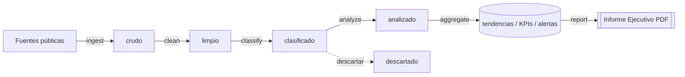

# Arquitectura — Venezuela Political Intelligence Dashboard (VPID)

> **Alcance del sistema:** VPID analiza **únicamente información pública y abiertamente
> disponible** (medios publicados, RSS, comunicados oficiales y APIs públicas
> autorizadas) sobre actores, partidos, medios y narrativas políticas de Venezuela,
> para usos legítimos (periodismo, investigación académica, observación electoral y
> análisis de sociedad civil). Consulte la [Política de Uso Ético y Legal](USO_ETICO.md).

Este documento describe la arquitectura técnica del sistema: componentes, flujo de
datos, modelo de datos, seguridad, caché, escalabilidad y las decisiones tecnológicas
adoptadas.

## Tabla de contenidos

1. [Visión general](#1-visión-general)
2. [Diagrama de alto nivel](#2-diagrama-de-alto-nivel)
3. [Responsabilidades por componente](#3-responsabilidades-por-componente)
4. [Flujo de datos (ingest → clean → classify → analyze → aggregate → report)](#4-flujo-de-datos)
5. [Modelo de datos](#5-modelo-de-datos)
6. [Modelo de seguridad](#6-modelo-de-seguridad)
7. [Estrategia de caché](#7-estrategia-de-caché)
8. [Escalabilidad y rendimiento](#8-escalabilidad-y-rendimiento)
9. [Decisiones tecnológicas y compromisos](#9-decisiones-tecnológicas-y-compromisos)
10. [Documentos relacionados](#10-documentos-relacionados)

---

## 1. Visión general

VPID es una plataforma OSINT (inteligencia de fuentes abiertas) compuesta por cinco
piezas cooperantes:

| Pieza | Tecnología | Función |
|-------|-----------|---------|
| **Frontend** | HTML5/CSS3/JS + Tailwind CSS + ApexCharts + Chart.js + Leaflet | Interfaz de visualización (12 módulos). |
| **API** | FastAPI + Python + SQLAlchemy async | Contrato REST `/api/v1`, autenticación, lógica de negocio. |
| **ETL** | Python + APScheduler | Pipeline diario automatizado de ingesta y análisis. |
| **Base de datos** | PostgreSQL 15+ / Supabase | Almacenamiento relacional, búsqueda full-text, RLS. |
| **Caché** | Redis | Aceleración de consultas frecuentes y resultados de agregación. |
| **PDF** | reportlab | Generación del Informe Ejecutivo (único formato de exportación). |

El sistema funciona en torno a un ciclo diario: el ETL recolecta artículos públicos,
los limpia, clasifica y analiza (sentimiento, narrativas, tendencias, alertas), agrega
resultados en KPIs y series temporales, y finalmente genera un Informe Ejecutivo en PDF.
La API expone estos datos y el frontend los presenta.

> **Único formato de exportación: PDF.** No se generan Excel, CSV ni Word. Esta
> restricción es transversal a toda la arquitectura (ver módulos `reportes` y
> `reportlab`).

---

## 2. Diagrama de alto nivel

```
                          FUENTES PÚBLICAS (externas)
        ┌───────────────────────────────────────────────────────────┐
        │  Medios web · Feeds RSS · Comunicados oficiales · APIs       │
        │  públicas autorizadas  (respetando robots.txt / ToS)        │
        └───────────────────────────────┬───────────────────────────┘
                                         │ HTTP (User-Agent identificado)
                                         ▼
   ┌──────────────────────────────────────────────────────────────────────┐
   │                         SERVICIO ETL (APScheduler)                     │
   │  ingest → clean → classify → analyze → aggregate → report             │
   │  (cron diario; ver ETL_SCHEDULE_CRON / REPORT_DAILY_CRON)             │
   └───────────┬───────────────────────────────────────────┬──────────────┘
               │ escribe/lee                                 │ genera
               ▼                                             ▼
   ┌───────────────────────────┐                 ┌──────────────────────────┐
   │   PostgreSQL / Supabase    │                 │   PDF (reportlab)        │
   │  artículos, menciones,     │◄────────────────│   storage/reports/*.pdf  │
   │  sentimiento, narrativas,  │   metadatos     └──────────────────────────┘
   │  tendencias, KPIs, alertas,│
   │  fuentes, actores, RLS     │
   └─────────────┬─────────────┘
                 │ SQLAlchemy async
                 ▼
   ┌───────────────────────────┐      cache       ┌──────────────────────────┐
   │     API FastAPI            │◄────────────────►│        Redis             │
   │     /api/v1/*  (JWT)       │   TTL 300 s      │   KPIs, agregaciones     │
   └─────────────┬─────────────┘                  └──────────────────────────┘
                 │ REST JSON / application/pdf
                 ▼
   ┌──────────────────────────────────────────────────────────────────────┐
   │  nginx (reverse proxy + estáticos)                                     │
   │   /api/  → backend:8000      /  → SPA estática (frontend)             │
   └─────────────┬─────────────────────────────────────────────────────────┘
                 │ HTTPS
                 ▼
   ┌──────────────────────────────────────────────────────────────────────┐
   │  FRONTEND (navegador)  — 12 módulos                                    │
   │  Tailwind UI · ApexCharts/Chart.js (gráficos) · Leaflet (mapas)       │
   └──────────────────────────────────────────────────────────────────────┘
```

---

## 3. Responsabilidades por componente

### 3.1 Frontend (navegador)

- Renderiza los **12 módulos funcionales** (ver tabla en [§3.7](#37-los-12-módulos-funcionales)).
- Consume exclusivamente la API REST `/api/v1`; no accede a la base de datos.
- **Visualización:** ApexCharts y Chart.js para gráficos (KPIs, evolución, sentimiento,
  rankings); Leaflet para mapas interactivos territoriales.
- **Tailwind CSS** para el sistema de diseño y el modo claro/oscuro (preferencia
  persistida en `usuarios.preferencias`).
- Maneja el token JWT (Bearer) y los filtros avanzados (fecha, estado, municipio,
  organización, actor, medio, tema, relevancia).
- La descarga del Informe Ejecutivo se hace vía `GET /reportes/{id}/pdf`
  (`application/pdf`).

### 3.2 API (FastAPI + SQLAlchemy async)

- Implementa el contrato REST documentado en [API.md](API.md), base `/api/v1`.
- **Autenticación/autorización:** valida JWT, resuelve el rol (admin/analista/editor/lector)
  y aplica RBAC por endpoint.
- **Acceso a datos asíncrono** con SQLAlchemy async sobre `asyncpg`.
- **Caché de lectura** en Redis para endpoints de alto tráfico (`/dashboard/kpis`,
  `/dashboard/overview`, `/actores/ranking`, `/territorial/resumen`).
- **Auditoría:** registra acciones sensibles (login, exportación de PDF, cambios en
  fuentes) en la tabla `auditoria`.
- **Orquesta** la generación de reportes bajo demanda (`POST /reportes/generar`) y
  expone el estado del ETL (`GET /etl/estado`).

### 3.3 ETL (APScheduler)

- Proceso independiente (`python -m app.etl.scheduler`) que ejecuta el pipeline diario.
- Programado por cron (`ETL_SCHEDULE_CRON`, por defecto `0 5 * * *`, zona
  `America/Caracas`).
- Cada etapa (`ingest`, `clean`, `classify`, `analyze`, `aggregate`) registra su
  ejecución y métricas en `etl_ejecuciones` para observabilidad.
- **Respeta `robots.txt` y los ToS** de cada fuente (`ETL_RESPECT_ROBOTS_TXT`,
  `robots_ok` por fuente) y se identifica con `ETL_USER_AGENT`.
- Tras el ETL, dispara la generación del Informe Ejecutivo diario
  (`REPORT_DAILY_CRON`, por defecto `0 6 * * *`).

### 3.4 Base de datos (PostgreSQL / Supabase)

- Fuente de verdad relacional. Esquema canónico en
  [`database/schema.sql`](../database/schema.sql).
- Extensiones: `pgcrypto` (UUID), `pg_trgm` (similitud difusa), `unaccent`
  (búsqueda sin acentos), `citext` (email case-insensitive).
- **Búsqueda full-text en español** mediante una columna generada `tsv` con índice GIN
  sobre `articulos`.
- **Vistas** de conveniencia para la API (`v_ranking_actores`, `v_resumen_territorial`).
- En despliegue Supabase, se habilita **Row-Level Security (RLS)** y se integra con
  Supabase Auth.

### 3.5 Caché (Redis)

- Almacena resultados de consultas costosas y agregaciones (TTL configurable
  `CACHE_TTL_SECONDS`, por defecto 300 s).
- Soporta `--appendonly yes` (persistencia AOF) en el stack local.
- Puede usarse como backend de rate-limiting y como cola ligera de coordinación.

### 3.6 Generación de PDF (reportlab)

- Construye el **Informe Ejecutivo** con: portada, fecha, resumen ejecutivo, KPIs,
  tendencias del día, actores más mencionados, narrativas predominantes, análisis
  territorial, alertas, gráficos de evolución y conclusiones/recomendaciones por IA.
- Persiste el archivo en `REPORTS_STORAGE_PATH` y registra metadatos en `reportes`
  (`archivo_path`, `archivo_bytes`, `pdf_sha256` para integridad).
- **PDF es el único formato de exportación permitido en toda la plataforma.**

### 3.7 Los 12 módulos funcionales

| # | Módulo | Datos / endpoints principales |
|---|--------|-------------------------------|
| 1 | Dashboard Ejecutivo | `kpi_snapshots` · `/dashboard/kpis`, `/dashboard/overview` |
| 2 | Monitoreo de Noticias | `articulos` · `/articulos` |
| 3 | Análisis de Tendencias | `tendencias` · `/tendencias`, `/tendencias/emergentes` |
| 4 | Detección de Narrativas | `narrativas` · `/narrativas` |
| 5 | Análisis de Sentimiento (IA) | `analisis_sentimiento` · `/sentimiento/resumen` |
| 6 | Ranking de Actores Públicos | `v_ranking_actores` · `/actores/ranking` |
| 7 | Monitoreo Territorial | `v_resumen_territorial` · `/territorial/resumen` |
| 8 | Sistema de Alertas Tempranas | `alertas` · `/alertas` |
| 9 | Mapas Interactivos | `estados`/`municipios` + Leaflet · `/territorial/resumen` |
| 10 | Comparativos Históricos | `tendencias`/`kpi_snapshots` · `/comparativos` |
| 11 | Centro de Inteligencia Digital | búsqueda + cruces · `/buscar` |
| 12 | Generación de Informes (PDF) | `reportes` · `/reportes`, `/reportes/generar`, `/reportes/{id}/pdf` |

---

## 4. Flujo de datos

El pipeline sigue seis fases. Cada transición de estado se refleja en la columna
`articulos.estado` (enum `estado_articulo`).



| Fase | Job ETL | Entrada → Salida | Qué hace |
|------|---------|------------------|----------|
| **Ingest** | `ingest` | Fuente → `articulos` (`crudo`) | Lee feeds RSS / páginas / APIs autorizadas; deduplica por `url_hash` (SHA-256 de la URL normalizada); registra `ultima_lectura`. |
| **Clean** | `clean` | `crudo` → `limpio` | Normaliza texto, extrae resumen/autor/imagen, detecta idioma, descarta ruido. |
| **Classify** | `classify` | `limpio` → `clasificado` | Asigna `tema_id`, geolocaliza (`estado_geo_id`, `municipio_id`), calcula `relevancia` y `alcance_estimado`, crea `menciones` de actores/organizaciones. |
| **Analyze** | `analyze` | `clasificado` → `analizado` | Calcula `analisis_sentimiento` (motor IA/léxico) y agrupa artículos en `narrativas`. |
| **Aggregate** | `aggregate` | `analizado` → `tendencias`, `kpi_snapshots` | Consolida series diarias por tema/actor/estado, calcula variaciones y evalúa reglas de `alertas`. |
| **Report** | (job de reportes) | agregados → PDF | Genera el Informe Ejecutivo con reportlab y lo registra en `reportes`. |

Detalle por motor (sentimiento, narrativas, tendencias, alertas, PDF) en
[MANUAL_TECNICO.md](MANUAL_TECNICO.md#7-motores-de-análisis-y-pipeline-etl).

---

## 5. Modelo de datos

Fuente de verdad: [`database/schema.sql`](../database/schema.sql).
Datos de referencia: [`database/seed.sql`](../database/seed.sql).

### 5.1 Convenciones

- Claves primarias `uuid` (`gen_random_uuid()`), salvo `auditoria` (`bigint` identity).
- Marcas de tiempo `timestamptz` en UTC; `updated_at` mantenido por trigger
  `set_updated_at()`.
- Identificadores `snake_case`, nombres de dominio en español.
- Borrado suave (`deleted_at`/`activo`) donde aplica.

### 5.2 Tipos enumerados (ENUM)

| ENUM | Valores |
|------|---------|
| `rol_usuario` | admin, analista, editor, lector |
| `tipo_fuente` | medio, portal, rss, blog, red_social, comunicado_oficial, agencia, otra |
| `alcance_fuente` | local, regional, nacional, internacional |
| `estado_fuente` | activa, pausada, error, descartada |
| `tipo_actor` | persona, organizacion, partido, institucion, medio, colectivo |
| `sentimiento` | positivo, neutral, negativo, mixto |
| `nivel_relevancia` | baja, media, alta, critica |
| `severidad_alerta` | info, baja, media, alta, critica |
| `estado_alerta` | abierta, en_revision, reconocida, cerrada |
| `estado_articulo` | crudo, limpio, clasificado, analizado, descartado |
| `estado_reporte` | generando, completado, fallido |
| `estado_etl` | en_cola, ejecutando, completado, fallido, parcial |

### 5.3 Tablas principales

| Tabla | Propósito | Relaciones clave |
|-------|-----------|------------------|
| `roles` | Roles RBAC y mapa de permisos (`permisos jsonb`). | ← `usuarios` |
| `usuarios` | Cuentas; pueden delegar en Supabase Auth (`supabase_uid`). | → `roles` |
| `auditoria` | Bitácora append-only (acción, entidad, IP, user-agent). | → `usuarios` |
| `estados` | 24 estados de Venezuela (geo + población). | ← `municipios`, `articulos`, ... |
| `municipios` | Municipios (semilla: 29 de Táchira). | → `estados` |
| `organizaciones` | Partidos/medios/instituciones públicas (`tendencia`). | → `estados` |
| `actores` | Figuras públicas (`cargo`, `aliases[]` para matching). | → `organizaciones`, `estados`, `municipios` |
| `fuentes` | **Tabla administrativa de fuentes abiertas** (tipo, URL/RSS, alcance, `credibilidad`, `verificada`, `robots_ok`, `frecuencia_min`). | → `estados`, `organizaciones` |
| `temas` | Temas/categorías con `palabras_clave[]` y color. | ← `articulos`, `narrativas`, `tendencias` |
| `articulos` | Ítems públicos ingeridos; estado del pipeline; `tsv` full-text. | → `fuentes`, `temas`, `estados`, `municipios` |
| `menciones` | Núcleo analítico: vincula artículo ↔ actor/organización (`peso`). | → `articulos`, `actores`, `organizaciones` |
| `analisis_sentimiento` | Resultado de sentimiento por artículo/mención (`score`, `confianza`, `emociones`). | → `articulos`, `menciones` |
| `narrativas` | Agrupaciones temáticas/encuadres; `emergente`, `total_articulos`, `alcance_estimado`. | → `temas` |
| `narrativa_articulos` | N:N narrativa ↔ artículo con `similitud`. | → `narrativas`, `articulos` |
| `tendencias` | Serie diaria agregada (menciones, alcance, sentimiento, `variacion_pct`). | → `temas`, `actores`, `organizaciones`, `estados` |
| `kpi_snapshots` | Foto diaria de KPIs para el Dashboard Ejecutivo. | (única por `fecha`) |
| `alertas` | Alertas tempranas (`tipo`, `severidad`, `estado`, `umbral`, `valor`). | → `temas`, `actores`, `estados`, `narrativas`, `usuarios` |
| `reportes` | Metadatos de Informes PDF (`archivo_path`, `pdf_sha256`, `resumen`). | → `usuarios` |
| `etl_ejecuciones` | Observabilidad del pipeline (job, estado, items, duración). | → `fuentes` |

### 5.4 Vistas

| Vista | Devuelve |
|-------|----------|
| `v_ranking_actores` | Ranking de actores por menciones (últimos 30 días) con sentimiento promedio y alcance. Alimenta `/actores/ranking`. |
| `v_resumen_territorial` | Volumen de artículos y sentimiento por estado (últimos 30 días), con coordenadas. Alimenta `/territorial/resumen` y los mapas Leaflet. |

### 5.5 Relaciones (resumen)

```
fuentes ──< articulos >── temas
                │
                ├──< menciones >── actores >── organizaciones
                │                     │
                │                     └── estados/municipios
                ├──< analisis_sentimiento
                └──< narrativa_articulos >── narrativas

estados ──< municipios            tendencias ── (temas/actores/orgs/estados)
roles ──< usuarios ──< auditoria  alertas ── (temas/actores/estados/narrativas/usuarios)
```

---

## 6. Modelo de seguridad

### 6.1 Autenticación (JWT)

- Login en `POST /api/v1/auth/login` devuelve un **access token JWT** (Bearer).
- Algoritmo `JWT_ALGORITHM` (por defecto `HS256`) firmado con `JWT_SECRET_KEY`.
- Expiración configurable: `ACCESS_TOKEN_EXPIRE_MINUTES` (30) y
  `REFRESH_TOKEN_EXPIRE_DAYS` (7).
- Contraseñas con hash `bcrypt` (`PASSWORD_HASH_SCHEME`). El usuario admin de la
  semilla **debe cambiar su contraseña en el primer acceso**.
- En modo Supabase, la verificación de identidad puede delegarse a Supabase Auth
  (`usuarios.supabase_uid`).

### 6.2 Autorización (RBAC)

| Rol | Permisos (resumen `roles.permisos`) |
|-----|-------------------------------------|
| **admin** | Acceso total: configuración, fuentes, usuarios, auditoría (`{"all":true}`). |
| **analista** | Análisis, reportes y alertas; sin administración de usuarios. |
| **editor** | Gestión de fuentes y entidades; lectura analítica. |
| **lector** | Solo lectura del dashboard y descarga de informes PDF. |

La API aplica el rol por endpoint (p. ej. el CRUD de `/fuentes` exige editor/admin;
la administración de usuarios exige admin). Ver matriz en [API.md](API.md).

### 6.3 Auditoría

Toda acción sensible se registra en `auditoria` (acción, entidad afectada, `metadatos`,
`ip`, `user_agent`, fecha). Es **append-only** y consultable solo por admin.

### 6.4 Row-Level Security (Supabase)

En despliegues Supabase se habilita RLS por tabla y se definen políticas por rol. El
esquema incluye un ejemplo comentado para `reportes`:

```sql
ALTER TABLE reportes ENABLE ROW LEVEL SECURITY;
CREATE POLICY reportes_read ON reportes FOR SELECT
  USING ( auth.role() IN ('admin','analista','editor','lector') );
```

Las políticas completas se definen en `database/migrations` y en
[DESPLIEGUE.md](DESPLIEGUE.md#5-provisión-de-base-de-datos-en-supabase).

### 6.5 Defensa en profundidad adicional

- Cabeceras de seguridad en nginx (`X-Frame-Options`, `X-Content-Type-Options`,
  `Referrer-Policy`).
- CORS restringido a `FRONTEND_ORIGIN`.
- Secretos solo del lado servidor (`SUPABASE_SERVICE_ROLE_KEY`, `JWT_SECRET_KEY`,
  claves de IA) — nunca en el frontend.
- El bot ETL respeta `robots.txt`/ToS y se identifica con un User-Agent claro,
  alineado con la [Política de Uso Ético](USO_ETICO.md).

---

## 7. Estrategia de caché

| Aspecto | Decisión |
|---------|----------|
| **Motor** | Redis (`REDIS_URL`). |
| **TTL** | `CACHE_TTL_SECONDS` (300 s por defecto). |
| **Qué se cachea** | Respuestas de endpoints de lectura intensiva: `/dashboard/kpis`, `/dashboard/overview`, `/actores/ranking`, `/territorial/resumen`, agregados de `/tendencias` y `/comparativos`. |
| **Clave** | Hash de la ruta + parámetros de consulta (filtros). |
| **Invalidación** | Por TTL; además, el ETL puede invalidar claves al recalcular KPIs/agregados tras el `aggregate` diario. |
| **No se cachea** | Operaciones de escritura, descargas de PDF y datos por usuario/rol sensibles. |

Como los KPIs y tendencias se recomputan una vez al día, un TTL de minutos ofrece
respuestas casi instantáneas sin riesgo de mostrar datos obsoletos relevantes.

---

## 8. Escalabilidad y rendimiento

- **API sin estado:** se escala horizontalmente con múltiples workers
  (`uvicorn --workers`, o `gunicorn` con workers `uvicorn` en producción) detrás de
  nginx; ver [DESPLIEGUE.md](DESPLIEGUE.md#6-despliegue-en-producción).
- **ETL desacoplado:** corre como proceso/servicio aparte, evitando que la ingesta
  afecte la latencia de la API.
- **Índices:** GIN trigram (`organizaciones`, `actores`, `articulos.titulo`), GIN
  full-text (`articulos.tsv`), e índices B-tree por fecha/estado/tipo/severidad para
  las consultas del dashboard.
- **Agregaciones precomputadas:** `tendencias` y `kpi_snapshots` evitan recalcular
  series pesadas en cada request.
- **Caché Redis** para los endpoints de mayor tráfico (ver §7).
- **Paginación obligatoria** en colecciones (`/articulos`, `/alertas`, ...) con sobre
  `{items,total,page,size}` para acotar el tamaño de respuesta.
- **Frontend estático** servible desde CDN/nginx con caché de larga duración para
  `/assets/` (7 días, ver `deploy/nginx.conf`).
- **Límites de ingesta:** `ETL_MAX_ARTICLES_PER_SOURCE` y `frecuencia_min` por fuente
  controlan la carga sobre orígenes externos y la base de datos.

---

## 9. Decisiones tecnológicas y compromisos

| Decisión | Motivación | Compromiso / alternativa |
|----------|-----------|--------------------------|
| **FastAPI + SQLAlchemy async** | Alto rendimiento I/O-bound, tipado, OpenAPI automático. | Curva de async; se mitiga con patrones de repositorio. |
| **PostgreSQL + Supabase** | Relacional robusto, full-text en español, RLS, extensiones (`pg_trgm`, `unaccent`). Supabase aporta Auth + hosting. | Acoplamiento parcial a Supabase; mitigado manteniendo `schema.sql` como fuente de verdad y SQL estándar. |
| **Redis para caché** | Latencia muy baja; TTL simple. | Componente extra a operar; el sistema degrada a consultar la BD si Redis no está. |
| **APScheduler (no Celery)** | Pipeline diario simple, sin broker dedicado. | Menor paralelismo distribuido; suficiente para cadencia diaria. Escalable a Celery si crece el volumen. |
| **reportlab para PDF** | Control fino del layout del Informe Ejecutivo; sin dependencias de navegador headless. | Maquetado programático más verboso que HTML→PDF. |
| **Solo PDF como exportación** | Formato firmable (`pdf_sha256`), no editable, apto para difusión formal; coherente con uso responsable. | No hay exportación de datos crudos (Excel/CSV/Word) por diseño. |
| **Frontend vanilla + Tailwind** | Ligereza, sin framework SPA pesado; estáticos servibles por CDN. | Más cableado manual de estado; compensado con módulos bien delimitados. |
| **ApexCharts + Chart.js + Leaflet** | Cobertura de gráficos ricos y mapas interactivos sin construir visualizaciones desde cero. | Dos librerías de gráficos; se usan según el tipo de visualización. |
| **IA provider-agnóstica con fallback local** | Funciona sin claves (léxico local) y mejora con un proveedor (`AI_PROVIDER`). | Calidad del léxico local inferior al modelo; configurable. |

---

## 10. Documentos relacionados

- [MANUAL_TECNICO.md](MANUAL_TECNICO.md) — instalación, configuración, motores y extensión.
- [API.md](API.md) — referencia completa de la API REST.
- [MANUAL_USUARIO.md](MANUAL_USUARIO.md) — guía de uso de los 12 módulos.
- [DESPLIEGUE.md](DESPLIEGUE.md) — despliegue local y producción.
- [USO_ETICO.md](USO_ETICO.md) — política de uso ético y legal.
